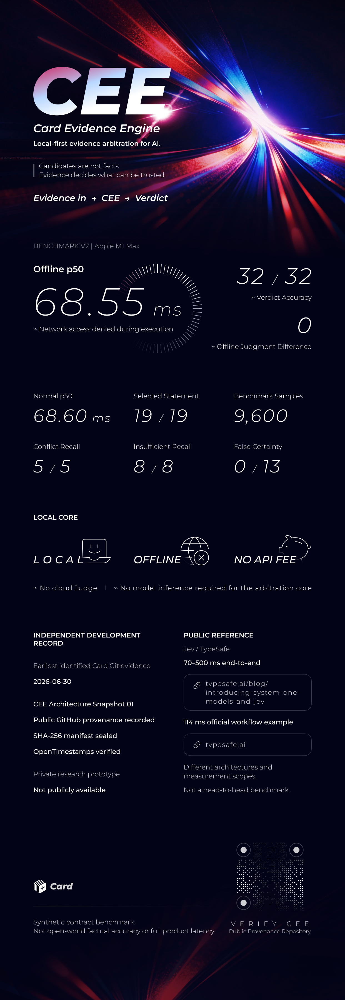

# CEE Architecture Provenance

This public repository records provenance for **CEE Architecture Snapshot 01**. It is proof-only: it contains no Card/CEE production source, benchmark Runner, benchmark script, fixtures, raw results, or private contract documents.

The private snapshot is retained outside this repository. Its payload files are identified by the public `MANIFEST.sha256`; the complete manifest is committed here and its own final SHA-256 is recorded in `MANIFEST.sha256.final.sha256`.

The manifest is also anchored with **OpenTimestamps**. The proof is published as `MANIFEST.sha256.ots` and has been successfully verified against **Bitcoin block 968259**, attesting that the manifest existed no later than **2026-09-23 CST**.

See `PROOF.md` for the Card Git evidence, commit anchors, scope boundary, OpenTimestamps verification, and the public Benchmark v2 summary.

